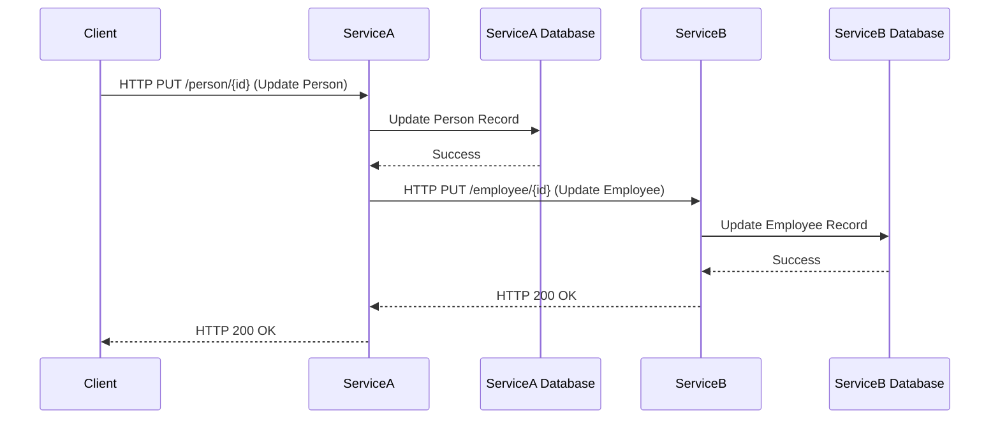
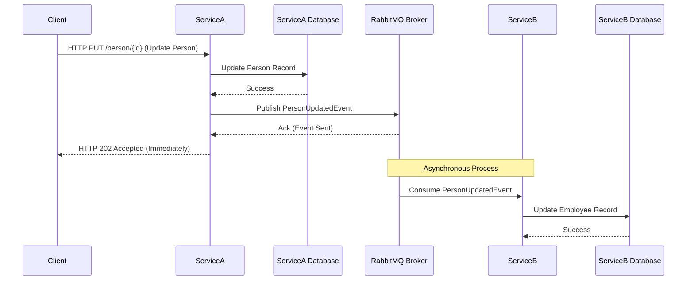

# Microservices-Synchronization-Patterns

This repository compares two distinct patterns for data synchronization and communication within a microservices architecture. It provides a side-by-side demonstration of a traditional **API-based (HTTP) approach** for synchronous communication and a more resilient **Event-Driven architecture** leveraging **MassTransit** and **RabbitMQ** for asynchronous communication. The examples illustrate how to maintain data consistency across decoupled services developed in a .NET environment.

## Architectural Approaches

The project is structured into two primary directories: `API_BASED` and `EVENT_BASED`. Each directory contains two services, `ServiceA` and `ServiceB`, implementing the same core functionality but using different communication paradigms.

### 1\. API-Based (Synchronous)

This pattern showcases direct communication between services using RESTful API calls over HTTP. When a data change occurs in the primary service (`ServiceA`), it immediately sends an HTTP request to the secondary service (`ServiceB`) to update its corresponding data. This offers straightforward and immediate synchronization but introduces a tight coupling between the services.

#### Diagram: Synchronous API Communication

  - **Workflow:**
    1.  **Client:** Sends a request to `ServiceA` to update the name of a `Person`.
    2.  **ServiceA:** Updates the `Person` record in its local MongoDB database.
    3.  **ServiceA:** Sends an immediate HTTP POST/PUT request to `ServiceB`'s API endpoint.
    4.  **ServiceB:** Receives the request and updates the corresponding `Employee` record in its local MongoDB database.

### 2\. Event-Based (Asynchronous)

This pattern demonstrates a decoupled approach where services communicate indirectly through events published to a message broker (`RabbitMQ`). When a change happens in `ServiceA` (e.g., a `Person` is updated), it publishes an event to RabbitMQ. Services like `ServiceB`, which are interested in these events, consume them and update their own data accordingly. This fosters greater resilience and independence between services.

#### Diagram: Asynchronous Event-Driven Communication

  - **Workflow:**
    1.  **Client:** Sends a request to `ServiceA` to update the name of a `Person`.
    2.  **ServiceA:** Updates the `Person` record in its local MongoDB database and publishes a `PersonUpdatedEvent` to RabbitMQ.
    3.  **ServiceA:** Immediately returns a response to the client.
    4.  **RabbitMQ:** Receives and queues the `PersonUpdatedEvent`.
    5.  **ServiceB:** (Using MassTransit) Consumes the `PersonUpdatedEvent` from the RabbitMQ queue.
    6.  **ServiceB:** Updates the corresponding `Employee` record in its local MongoDB database.

-----

## Technologies Used

  - **.NET 7/8:** The project is built using the .NET platform.
  - **MongoDB:** A NoSQL database used as the data store for both `ServiceA` and `ServiceB` in both architectural patterns.
  - **ASP.NET Core:** Framework for building the RESTful API services.
  - **MassTransit:** A distributed application framework for .NET, used to simplify working with RabbitMQ in the Event-Driven approach.
  - **RabbitMQ:** A robust message broker used for asynchronous communication in the Event-Driven approach.

## Getting Started

To run this project locally, please follow these steps:

### Prerequisites

  - [.NET SDK](https://dotnet.microsoft.com/download) (Ensure you have a compatible version installed)
  - [Docker Desktop](https://www.docker.com/products/docker-desktop/) (Required for running RabbitMQ easily)

### Running the Application

1.  **Clone the Repository:**
    Clone this repository to your local machine:
    `git clone [repository_url]`
    `cd Microservices-Synchronization-Patterns`

2.  **Run RabbitMQ (for Event-Driven)**:
    If you want to run the `EVENT_BASED` example, start a RabbitMQ instance using Docker:
    `docker run -d --hostname my-rabbit --name rabbit -p 5672:5672 -p 15672:15672 rabbitmq:3-management`

    You can access the RabbitMQ management UI at `http://localhost:15672` (default guest/guest credentials).

3.  **Navigate to the Project Directories:**
    Open separate terminal windows or IDE instances for `API_BASED/ServiceA`, `API_BASED/ServiceB`, `EVENT_BASED/ServiceA`, and `EVENT_BASED/ServiceB`.

4.  **Run the Services:**
    For each service, navigate to its directory in the terminal and run the application using the .NET CLI:
    `dotnet run`

    Alternatively, you can open the `Data_Synchronization_Examples.sln` file in Visual Studio and run the desired projects. Ensure you configure the "Multiple startup projects" setting if you want to run both services of a particular architecture simultaneously.

5.  **Access Swagger UI:**

      - For `API_BASED/ServiceA`: Navigate to `https://localhost:7196/swagger/index.html` in your browser.
      - For `API_BASED/ServiceB`: Navigate to `https://localhost:7197/swagger/index.html` in your browser.
      - For `EVENT_BASED/ServiceA`: Navigate to `https://localhost:{PortServiceA}/swagger/index.html` (replace `{PortServiceA}` with the actual HTTPS port of ServiceA).
      - For `EVENT_BASED/ServiceB`: Navigate to `https://localhost:{PortServiceB}/swagger/index.html` (replace `{PortServiceB}` with the actual HTTPS port of ServiceB).

    You can use the Swagger UI to interact with the API endpoints and trigger data synchronization. For the Event-Driven example, observe the logs of `ServiceB` to see the events being consumed and processed.

## Observing the Synchronization

  - **API-Based:** Use `ServiceA`'s Swagger UI to update a `Person`. You should see the corresponding update reflected in `ServiceB`'s data (you can verify this through `ServiceB`'s Swagger UI or by querying the MongoDB database).
  - **Event-Driven:** Use `ServiceA`'s Swagger UI to update a `Person`. Observe the logs of `ServiceB` in the console; you should see messages indicating that a `PersonUpdatedEvent` has been received and processed, and the corresponding `Employee` data has been updated in `ServiceB`'s database.

## Key Takeaways

  - **API-Based:** Simple for immediate consistency but introduces tight coupling and potential for cascading failures.
  - **Event-Driven:** Offers better decoupling, resilience, and scalability but introduces eventual consistency and adds complexity with the message broker.

This repository provides a practical understanding of these two fundamental patterns for microservice data synchronization, allowing you to make informed decisions based on the specific requirements of your distributed systems.

-----

